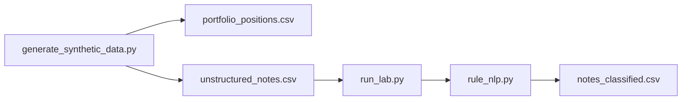

# IBM watsonx Analytics Lab (Local Simulation, Synthetic)

**Author:** Faiz Elahi · **Type:** EDUCATIONAL PORTFOLIO LAB · **SYNTHETIC DATA ONLY**

---

## Educational disclaimer / synthetic data

This lab **simulates** watsonx-style analytics workflows using **DuckDB SQL** and a **rule-based NLP stand-in**—not live watsonx.ai APIs, not IBM Cloud spend, and not real trading or clinical notes. All positions and notes are **synthetic**.

Use honest language: *“I combined structured risk SQL with rule-based note classification on synthetic portfolio and notes data.”*

---

## Problem statement (detailed)

Enterprise analytics on IBM stacks often blends **structured risk positions** with **unstructured text** (research notes, ops commentary). Teams need to:

- Filter **high-risk health-sector exposures** from a positions table
- Classify **notes** into domains (clinical, claims, finance) before routing to downstream models

This lab loads `portfolio_positions.csv` and `unstructured_notes.csv` into `ibm_analytics.duckdb`, prints top health-sector risk rows, and runs **`rule_nlp.py`** to write **`notes_classified.csv`**—a transparent baseline before discussing real watsonx.governance and foundation models.

---

## Why this tool

| Black-box AutoAI demo | This lab pipeline |
|-----------------------|-------------------|
| Hidden scoring | Visible SQL filters and keyword rules |
| No audit trail | CSV outputs you can diff in git |
| Cloud lock-in | Runs fully offline |

Pairs with **`financial-risk-portfolio-lab`** and **`langchain-langgraph-analyst-lab`**.

---

## Architecture



See [`docs/architecture.md`](docs/architecture.md).

---

## Dataset dictionary (tables / columns)

| File | Grain | Key columns | Notes |
|------|-------|-------------|-------|
| `portfolio_positions.csv` | Position | `instrument_id`, `sector`, `risk_score`, `notional_usd` | Includes `health` sector rows |
| `unstructured_notes.csv` | Note | `note_id`, `text` | Short synthetic paragraphs |
| `notes_classified.csv` | Note | `predicted_domain` | Output: clinical, claims, or finance |
| `ibm_analytics.duckdb` | Database | SQL tables `positions`, `notes` | Created on run |

---

## Prerequisites

- Python 3.10+
- `duckdb`, `pandas` (see `requirements.txt`)

---

## Step-by-step: how to run

### Windows PowerShell

```powershell
cd ibm-watsonx-analytics-lab
python -m venv .venv
.\.venv\Scripts\Activate.ps1
pip install -r requirements.txt
python scripts/generate_synthetic_data.py
python -m src.run_lab
python scripts/generate_charts.py
```

### Optional bash

```bash
cd ibm-watsonx-analytics-lab
python3 -m venv .venv && source .venv/bin/activate
pip install -r requirements.txt
python scripts/generate_synthetic_data.py
python -m src.run_lab
python scripts/generate_charts.py
```

---

## File-by-file walkthrough

| Path | Role |
|------|------|
| `scripts/generate_synthetic_data.py` | Positions and unstructured notes |
| `src/run_lab.py` | DuckDB load, high-risk health SQL, invokes classification |
| `src/rule_nlp.py` | Keyword rules → `notes_classified.csv` |
| `scripts/generate_charts.py` | Optional visuals under `docs/images/` |
| `docs/architecture.md` | Maps steps to watsonx concepts (honest simulation labels) |

---

## Expected outputs and how to interpret them

- Console: **Top health-sector positions** with `risk_score >= 0.5` ordered by risk.
- **`notes_classified.csv`** — Rule labels from keyword hits in `RULES` dict.
- First rows printed to console for quick inspection.

Rule NLP is **intentionally naive**—use to motivate ML and governance rather than as production classification.

---

## Results interpretation

- **Risk_score** is a synthetic scalar—not vendor PD/LGD models.
- **Keyword ties** can misclassify ambiguous sentences—discuss precision/recall tradeoffs.
- **Sector = health** is a book-of-business tag, not HIPAA coverage determination.

---

## Glossary (8+ terms)

1. **watsonx** — IBM generative AI and data platform brand (not invoked live here).
2. **Structured analytics** — SQL over typed tables (positions).
3. **Unstructured data** — Free-text notes requiring NLP.
4. **Risk score** — Synthetic ranking metric on positions.
5. **Notional USD** — Exposure amount for sorting and limits discussion.
6. **Rule-based NLP** — Keyword counting stand-in for classifiers.
7. **Domain routing** — Sending text to clinical vs finance workflows.
8. **Governance** — Model risk, lineage, and policy (discuss conceptually).
9. **DuckDB** — Local SQL engine for portfolio queries.

---

## Common mistakes (5+)

1. Claiming **watsonx deployment or IBM employment** from this educational repo.
2. Presenting **keyword rules** as equivalent to foundation-model extraction.
3. Ignoring **false positives** when keywords appear in unrelated context.
4. Mixing **trading risk** outputs with **clinical advice** narratives.
5. Skipping **model documentation** when upgrading rules to ML.
6. Storing **synthetic notes** with real identifiers in shared demos (bad habit).

---

## Exercises (5+)

1. Add **confidence scores** proportional to keyword hit counts.
2. Evaluate rules against a **hand-labeled** 20-note gold set you create.
3. Swap health filter to **sector = finance** and compare SQL results.
4. Write a paragraph on **watsonx.governance** model cards (conceptual research).
5. Chain note summaries to **`langchain-langgraph-analyst-lab`** agent pattern (conceptual).
6. Plot **risk_score distribution** by sector.

---

## Limitations / simulation vs production

- No IBM Cloud API keys, Watson Machine Learning, or watsonx.ai calls.
- Rule NLP only—no embeddings or LLM inference.
- Synthetic book—not investment advice.
- Educational code—**not model risk management sign-off**.

---

## Related labs

- [`financial-risk-portfolio-lab`](../financial-risk-portfolio-lab/) — VaR and concentration.
- [`langchain-langgraph-analyst-lab`](../langchain-langgraph-analyst-lab/) — Agentic analyst patterns.
- [`aws-health-finance-lake-lab`](../aws-health-finance-lake-lab/) — Lake ingest metaphor.

---

**Author:** Faiz Elahi · Educational portfolio use.
